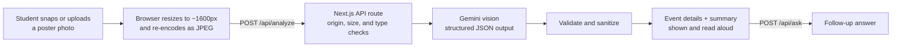

# Summareyes

**Accessible event posters for blind and low-vision SFSU students.**

Campus events are mostly advertised on printed flyers and image-only social posts. Screen readers can't read those. Poster Reader lets a student take a photo of a poster and get back the event details as clean, structured text. They also get a short spoken summary and can ask follow-up questions like *"Is there free food?"*

## How it works



1. **Capture.** The student picks or photographs a poster. The browser downsizes it and re-encodes it to JPEG. This keeps the upload small and strips EXIF/GPS metadata.
2. **Analyze.** `POST /api/analyze` sends the image to Gemini with a strict response schema. The model pulls out the event name, date, time, location, registration, host, and contact or link. It also writes a short visual description of the poster's imagery and a 2-4 sentence summary written to be spoken aloud.
3. **Validate.** The server checks the model's JSON against the schema. It strips invisible and control characters, caps the length of each field, and fills anything unreadable with `"Not found"`. If the image isn't a poster, the response says so plainly.
4. **Ask.** `POST /api/ask` answers one follow-up question about the same image. It answers only from what is printed on the poster. If the poster doesn't say, the answer is *"The poster doesn't say."*

### Design principles

- **Never guess.** The model transcribes only what is printed. It doesn't add a year, a room number, or a weekday. Unclear text is flagged in `confidence_notes`.
- **Privacy first.** The app is stateless: it never stores or logs images, questions, or results. It never identifies people from their faces or guesses their demographics. It never follows QR codes and ignores ID cards.
- **Prompt-injection resistant.** All text in the image, and every question, is treated as untrusted data, never as instructions.
- **Screen-reader friendly.** Summaries are written for speech ("12 to 3 PM", not "12-3PM"). Error messages are written to be read aloud.
- **Graceful failure.** Errors use stable codes. The server retries once when Google's AI is briefly overloaded. A verified sample result (`?demo=1`) is available if the AI quota runs out.

## Tech stack

| Layer | Choice |
|---|---|
| Framework | [Next.js 16](https://nextjs.org) (App Router, Route Handlers) + React 19 |
| Language | TypeScript |
| Styling | Tailwind CSS 4 |
| AI | Google Gemini via [`@google/genai`](https://www.npmjs.com/package/@google/genai) (default model `gemini-3.5-flash-lite`) |
| Hosting | Vercel |

## Running locally

```bash
npm install
cp .env.example .env.local   # then add your GEMINI_API_KEY
npm run dev
```

Open http://localhost:3000. You can get a free Gemini API key from [Google AI Studio](https://aistudio.google.com/apikey). To use a different model, set `GEMINI_MODEL`.

> **Note:** On the free Gemini tier, Google may use submitted images to improve its products. Don't upload images with sensitive personal information.
